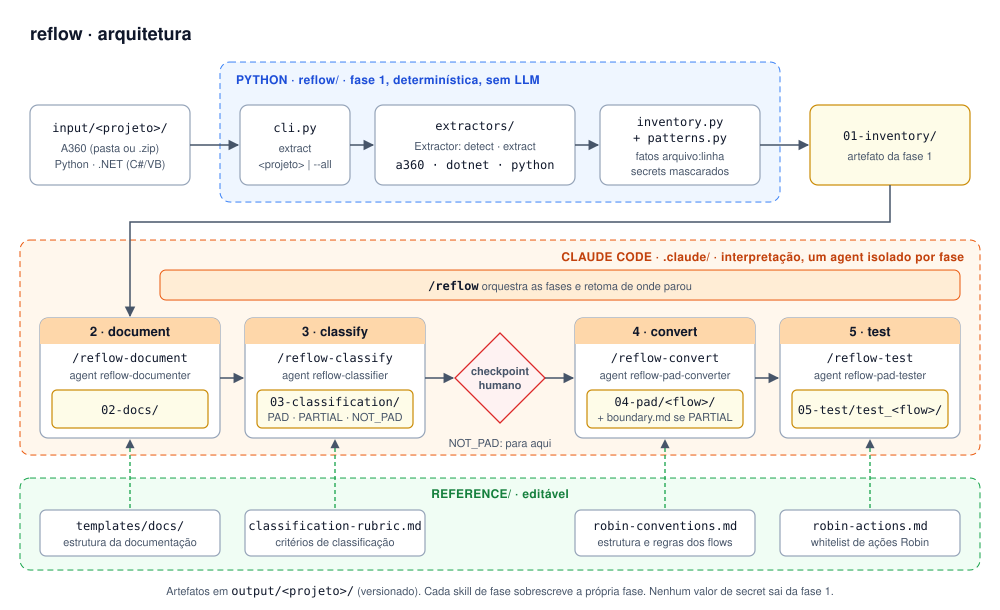

# reflow

Migração assistida de código legado (Automation Anywhere A360, Python e .NET) para Power Automate Desktop.



## Instalação

O reflow não é instalável: é um script Python (só stdlib) que roda da raiz deste repositório. Pré-requisitos:
[uv](https://docs.astral.sh/uv/) (instala o Python 3.12+ se preciso) e [Claude Code](https://claude.com/claude-code).

```bash
git clone <url-deste-repo> reflow && cd reflow
uv sync
```

## Uso

1. Coloque cada projeto legado numa subpasta de `input/`. Para A360, a pasta exportada ou o `.zip` do export.
   Para .NET (C# ou VB.NET), o código-fonte da solution. Binários `.exe`/`.dll` precisam ser decompilados antes
   (ex.: ILSpy).
   O exemplo público `input/quote-scraper/` já vem no repositório.
2. Abra o Claude Code na raiz deste repositório (`claude`) e rode:
   ```
   /reflow                  # todos os projetos
   /reflow quote-scraper    # um projeto
   ```
   Depois da classificação, o `/reflow` mostra o veredito e pede confirmação antes de converter.
3. Revise a saída em `output/<projeto>/`:
   - `01-inventory/inventory.json`: fatos extraídos do código (`arquivo:linha`), com secrets mascarados
   - `02-docs/`: objetivo de negócio, use cases, dados, integrações, regras e riscos
   - `03-classification/classification.md`: `PAD` / `PARTIAL` / `NOT_PAD` com justificativa
   - `04-pad/`: um `Main.robin` por flow, para colar no `Main` do PAD e rodar (veja o `README.md` de cada flow)
   - `05-test/`: flow Robin de teste, que confere o resultado do flow convertido

Também é possível rodar cada fase separadamente: `/reflow-extract`, `/reflow-document`, `/reflow-classify`,
`/reflow-convert` e `/reflow-test`.

## Do flow para o PAD

Cada flow é um único `Main.robin`, feito para colar e rodar sem preparo (sem config, pastas ou variáveis para criar):

1. No Power Automate Desktop, crie um desktop flow e cole o `04-pad/<flow>/Main.robin` inteiro no `Main` (Ctrl+V).
2. Rode. A saída vai para `C:\Users\Public\Documents\`.
3. Para conferir, cole o `05-test/test_<flow>/Main.robin` num segundo flow e rode. O PASS/FAIL de cada cenário fica
   no log indicado no `README.md` do teste.

Pré-requisito para flows de browser: Edge com a extensão **Microsoft Power Automate** ativa.

## Whitelist de ações Robin

O conversor só usa as ações de `reference/robin-actions.md`. As marcadas `[validado PAD: rodou]` já rodaram num PAD
real; as `[não validado]` foram escritas de memória. Para validar uma ação, monte-a no designer do PAD, dê Ctrl+C e
substitua o snippet pelo texto copiado.

## Desenvolvimento

```bash
uv sync
uv run pytest
uv run ruff check . && uv run ruff format .
```

Veja o `CLAUDE.md` para as decisões de arquitetura.
