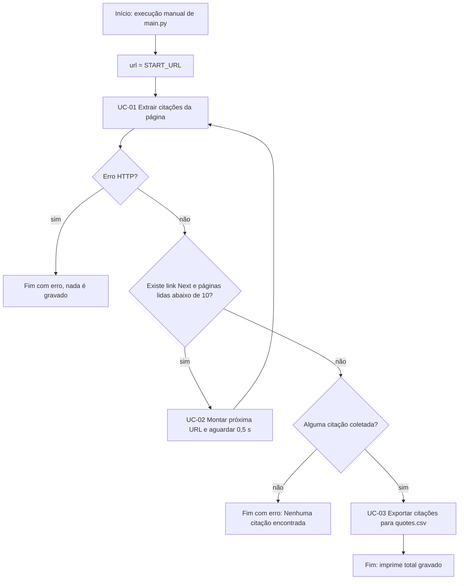

# Fluxo do processo

## Narrativa
1. O processo é disparado manualmente executando `main.py` (`main.py:59-60`, `README.md:11-14`).
2. `main()` chama `crawl()` (`main.py:52`), que começa pela página inicial do site (`main.py:11`, `main.py:19`).
3. Para cada página, o robô baixa o HTML e extrai as citações (UC-01, `main.py:21-34`). Um erro HTTP aborta todo o processo (`main.py:23`).
4. O robô segue o link "Next" até ele não existir mais ou até atingir 10 páginas, com pausa de 0,5 s entre páginas (UC-02, `main.py:20`, `main.py:36-40`).
5. Se nenhuma citação foi coletada, o processo termina com erro (`main.py:53-54`).
6. Caso contrário, as citações são gravadas em `quotes.csv`, sobrescrevendo o arquivo anterior (UC-03, `main.py:55`, `main.py:44-48`), e o total é impresso no console (`main.py:56`).

## Mapa de componentes legados
| Componente (bot/módulo) | Papel | Chamado por |
|---|---|---|
| `main.py` → `main()` | orquestrador | entrypoint (`main.py:59-60`) |
| `main.py` → `crawl()` | navegação e extração (UC-01, UC-02) | `main()` (`main.py:52`) |
| `main.py` → `save()` | gravação do CSV (UC-03) | `main()` (`main.py:55`) |
