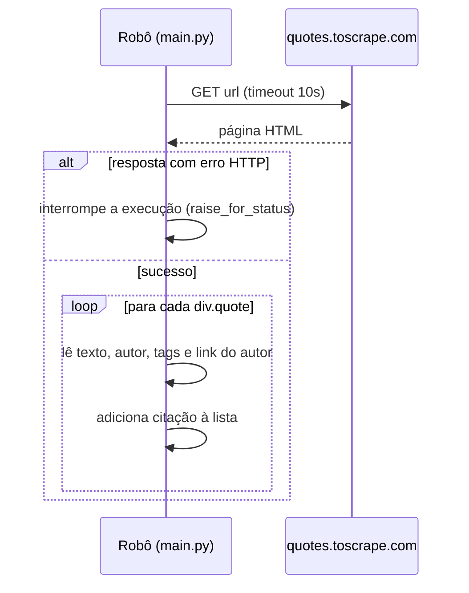
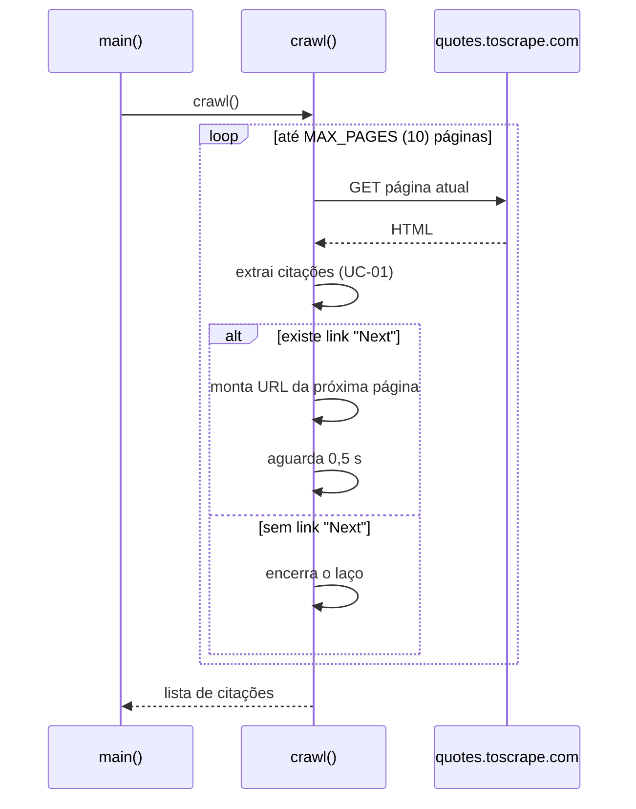
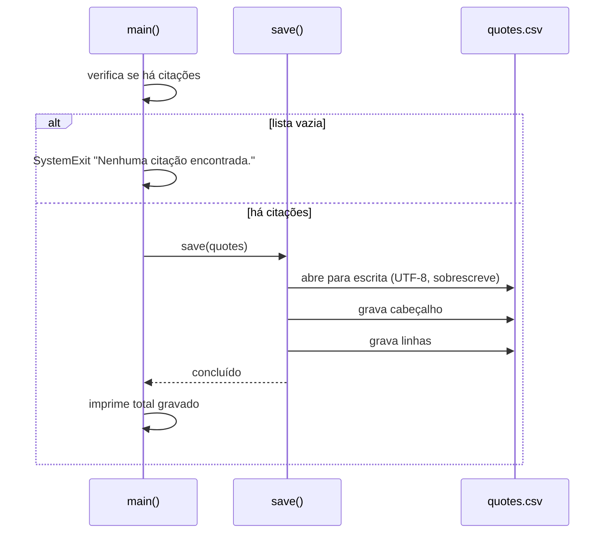

# Use cases

> Os 3 use cases principais (por impacto no negócio) têm diagrama de sequência.
>
> O projeto tem um único entrypoint (`main.py`). Os UCs abaixo são etapas de negócio desse mesmo processo, executadas em sequência por `main()` (`main.py:51-56`).

## UC-01 — Extrair citações de uma página do site ⭐ principal

- **Ator**: robô (script `main.py`)
- **Pré-condições**: acesso à internet e ao site `quotes.toscrape.com` [inferido]. URL da página atual definida (`main.py:19`, `main.py:39`).
- **Legado**: `main.py:21-34`

### Inputs
| Input | Origem | Tipo/formato | Evidência |
|---|---|---|---|
| URL da página | `START_URL` na primeira iteração e link "Next" nas seguintes | texto (URL) | `main.py:11`, `main.py:19`, `main.py:39` |
| Página HTML | site quotes.toscrape.com (HTTP GET) | HTML | `main.py:22`, `main.py:24` |

### Processamento
1. Registra no console a página que está sendo lida (`main.py:21`).
2. Baixa a página com timeout de 10 segundos (`main.py:22`).
3. Se a resposta HTTP for de erro, interrompe a execução (`main.py:23`).
4. Interpreta o HTML (`main.py:24`).
5. Para cada bloco de citação (`div.quote`) da página (`main.py:26`):
   - pega o texto (`span.text`) e remove as aspas tipográficas “ ” das pontas (`main.py:29`);
   - pega o autor (`small.author`) (`main.py:30`);
   - junta as tags (`a.tag`) num texto separado por `|` (`main.py:31`);
   - monta o link absoluto da página do autor a partir do `href` que começa com `/author` (`main.py:32`).
6. Acrescenta a citação à lista em memória (`main.py:27`).

**Exceções**: erro HTTP (4xx/5xx) ou timeout aborta todo o processo sem gravar nada (`main.py:22-23`). Se algum bloco de citação não tiver um dos elementos esperados, o script falha com erro não tratado (`main.py:29-32`) [inferido].

### Outputs
| Output | Destino | Tipo/formato | Evidência |
|---|---|---|---|
| Citações da página (`text`, `author`, `tags`, `author_url`) | lista `quotes` em memória | lista de dicionários | `main.py:27-34` |
| Log "Lendo <url>" | console | texto | `main.py:21` |

### Diagrama de sequência

## UC-02 — Percorrer as páginas de citações ⭐ principal

- **Ator**: robô (script `main.py`)
- **Pré-condições**: UC-01 executado para a página atual.
- **Legado**: `main.py:17-41`

### Inputs
| Input | Origem | Tipo/formato | Evidência |
|---|---|---|---|
| URL inicial | constante `START_URL` | texto (URL) | `main.py:11` |
| Limite de páginas | constante `MAX_PAGES` | inteiro (10) | `main.py:13` |
| Pausa entre páginas | constante `DELAY_SECONDS` | segundos (0,5) | `main.py:14` |
| Link "Next" | página HTML (`li.next a`) | `href` relativo | `main.py:36` |

### Processamento
1. Começa pela URL inicial (`main.py:19`).
2. Repete no máximo `MAX_PAGES` vezes (`main.py:20`):
   - executa o UC-01 na página atual (`main.py:21-34`);
   - procura o link "Next" (`main.py:36`);
   - se não houver link "Next", encerra a navegação (`main.py:37-38`);
   - senão, monta a URL absoluta da próxima página (`main.py:39`) e aguarda 0,5 s antes de seguir (`main.py:40`).
3. Devolve a lista acumulada de citações (`main.py:41`).

**Exceções**: se o site tiver mais páginas que `MAX_PAGES`, a navegação para no limite sem aviso (`main.py:13`, `main.py:20`). Falhas de página seguem as exceções do UC-01.

### Outputs
| Output | Destino | Tipo/formato | Evidência |
|---|---|---|---|
| Lista de todas as citações coletadas | retorno de `crawl()` para `main()` | lista de dicionários | `main.py:41`, `main.py:52` |

### Diagrama de sequência

## UC-03 — Exportar citações para CSV ⭐ principal

- **Ator**: robô (script `main.py`)
- **Pré-condições**: UC-02 concluído com a lista de citações em memória.
- **Legado**: `main.py:44-56`

### Inputs
| Input | Origem | Tipo/formato | Evidência |
|---|---|---|---|
| Lista de citações | retorno de `crawl()` | lista de dicionários | `main.py:52` |
| Caminho de saída | constante `OUTPUT` (`quotes.csv` na pasta do script) | caminho de arquivo | `main.py:12` |

### Processamento
1. Se a lista estiver vazia, encerra com a mensagem "Nenhuma citação encontrada." e não grava o arquivo (`main.py:53-54`).
2. Abre `quotes.csv` para escrita em UTF-8, sobrescrevendo o conteúdo anterior (`main.py:45`).
3. Grava o cabeçalho `text,author,tags,author_url` (`main.py:46-47`).
4. Grava uma linha por citação (`main.py:48`).
5. Informa no console quantas citações foram gravadas e onde (`main.py:56`).

**Exceções**: lista vazia encerra o processo com erro (`main.py:54`). Falhas de escrita do arquivo não são tratadas (`main.py:45`) [inferido].

### Outputs
| Output | Destino | Tipo/formato | Evidência |
|---|---|---|---|
| `quotes.csv` | pasta do script | CSV UTF-8, colunas `text`, `author`, `tags`, `author_url` | `main.py:12`, `main.py:45-48` |
| Mensagem "N citações gravadas em ..." | console | texto | `main.py:56` |

### Diagrama de sequência

