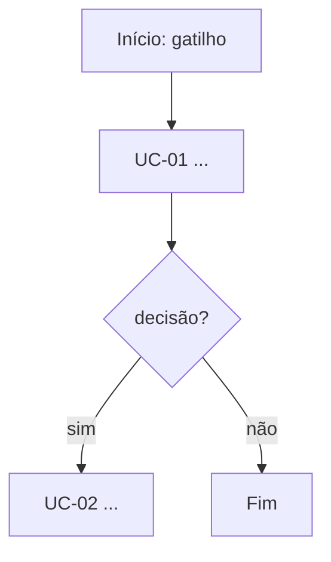

# Fluxo do processo

## Narrativa
<Passo a passo ponta a ponta, referenciando os UCs e os arquivos/bots (`arquivo:linha`).>

## Mapa de componentes legados
| Componente (bot/módulo) | Papel | Chamado por |
|---|---|---|
| `Bots/Main` | orquestrador | entrypoint |
