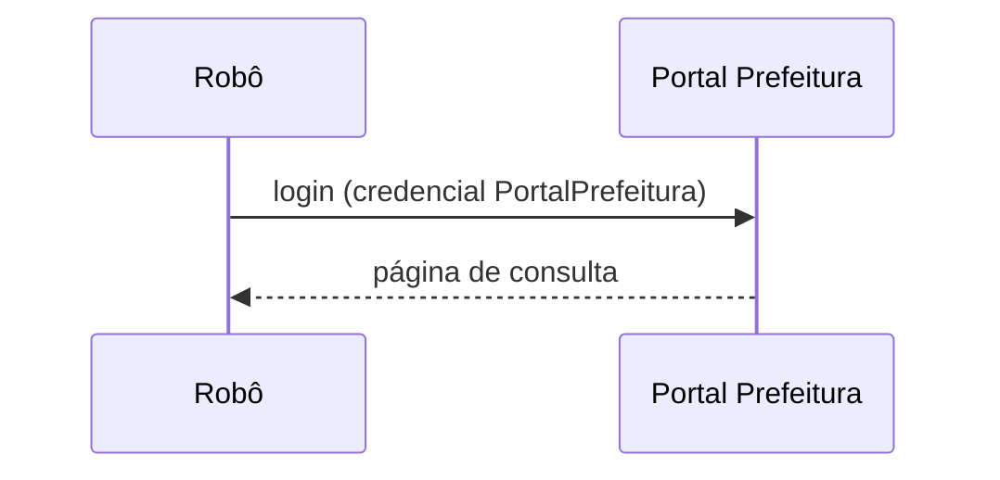

# Use cases

> Os 3 use cases principais (por impacto no negócio) têm diagrama de sequência.

## UC-01 — <nome em verbo + objeto, ex.: "Consultar notas no portal da prefeitura"> ⭐ principal

- **Ator**: <robô / usuário / sistema>
- **Pré-condições**: <...>
- **Legado**: `<arquivo:linha-inicial-final>`

### Inputs
| Input | Origem | Tipo/formato | Evidência |
|---|---|---|---|
| <CNPJ> | <planilha \\fs01\...> | <texto 14 dígitos> | `arquivo:linha` |

### Processamento
1. <passo de negócio> (`arquivo:linha`)
2. <...>

**Exceções**: <o que acontece quando falha / caminhos alternativos>

### Outputs
| Output | Destino | Tipo/formato | Evidência |
|---|---|---|---|
| <tabela de notas> | <SQL Fiscal.notas> | <...> | `arquivo:linha` |

### Diagrama de sequência

## UC-02 — ...
<!-- Use cases que não estão no top 3: mesma estrutura, sem o diagrama de sequência. -->
